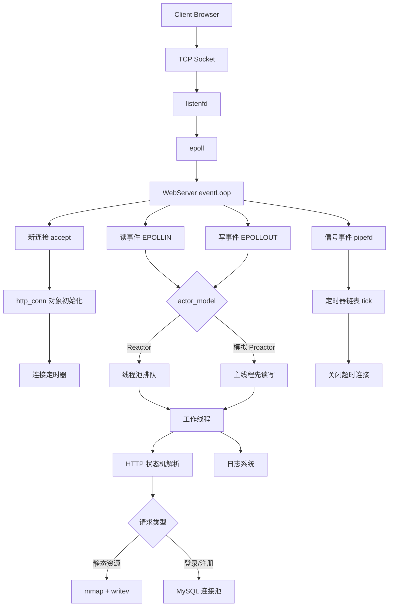
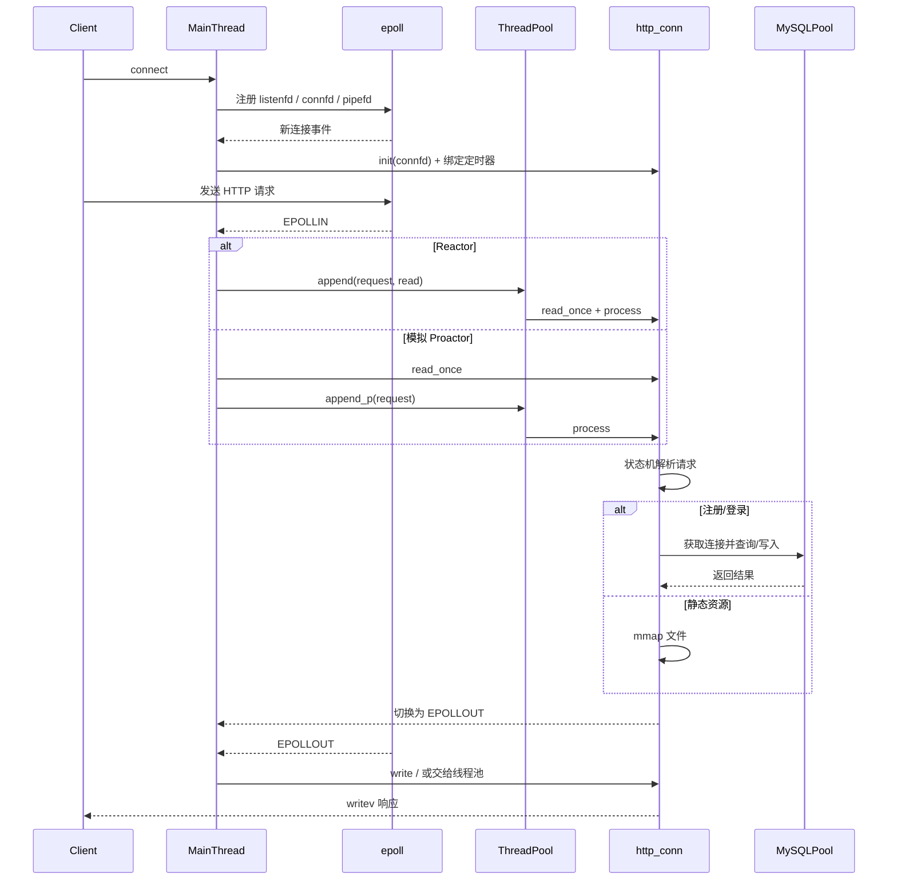

# TinyWebServer 面试文档

## 1. 项目一句话介绍

这是一个基于 Linux 的轻量级高性能 Web 服务器，核心采用 `epoll + 非阻塞 socket + 线程池` 的并发模型，支持 `Reactor / 模拟 Proactor` 两种事件处理方式，支持 `LT / ET` 触发模式切换，使用状态机解析 HTTP 请求，并通过数据库连接池实现用户注册登录，同时集成定时器和同步/异步日志系统。

## 2. 面试时怎么开场介绍

### 30 秒版本

我做了一个 Linux 下的 C++ WebServer，核心用了 `epoll` 做 I/O 多路复用，主线程负责监听和事件分发，工作线程池负责业务处理；HTTP 请求通过状态机解析，静态资源通过 `mmap + writev` 零拷贝风格发送；另外还实现了数据库连接池、定时器关闭非活跃连接、同步/异步日志，以及注册登录功能。

### 1 分钟版本

这个项目本质上是一个基于 `半同步/半反应堆` 思路实现的轻量级服务器。主线程负责 `socket` 创建、`bind/listen`、`epoll_wait` 事件监听和连接管理；当监听到连接、读写、信号事件后，按照配置把任务交给线程池。请求处理部分用主从状态机完成 HTTP 报文解析，支持 GET 和 POST，静态文件通过 `mmap` 映射，响应发送时用 `writev` 减少数据拷贝。为了提高并发能力，还实现了 MySQL 连接池、升序定时器链表、异步日志。项目支持 `LT/ET`、`Reactor/Proactor`、同步/异步日志等多种运行模式，方便做性能对比和面试展示。

### 3 分钟版本

如果面试官愿意继续听，可以按下面顺序展开：

1. 整体架构上，主线程只做事件监听和分发，不做重业务逻辑，避免阻塞 `epoll_wait`。
2. 新连接到来后会创建 `http_conn` 对象，同时给连接绑定一个定时器，用于清理长时间不活跃的连接。
3. 读事件和写事件会根据 `actor_model` 进入 `Reactor` 或 `模拟 Proactor` 流程：
   - `Reactor` 模式下，主线程只把事件放进任务队列，真正的 `read/write` 在工作线程里执行。
   - `模拟 Proactor` 模式下，主线程先完成数据读写，再把业务处理放到线程池。
4. HTTP 解析用状态机拆成请求行、请求头、请求体三个阶段，POST 请求支持登录和注册。
5. 静态文件通过 `mmap` 映射到用户态地址空间，再通过 `writev` 把响应头和文件内容一次发送。
6. 并发配套包括线程池、信号量、互斥锁、数据库连接池、日志阻塞队列、信号驱动定时器。
7. 面试时我会重点强调这个项目不仅是“能跑”，而且我理解每个模块为什么要这样设计，以及每种设计的优缺点和优化空间。

## 3. 项目目录和模块职责

| 目录/文件 | 作用 |
| --- | --- |
| `main.cpp` | 程序入口，负责配置解析和各模块初始化 |
| `config.*` | 命令行参数解析，控制端口、日志、触发模式、线程池大小等 |
| `webserver.*` | 服务器主控类，串起监听、epoll、线程池、连接、定时器 |
| `http/http_conn.*` | HTTP 连接管理、请求解析、响应构造、静态资源发送 |
| `threadpool/threadpool.h` | 工作线程池，处理 Reactor/Proactor 模式下的任务 |
| `timer/lst_timer.*` | 升序双向链表定时器，清理超时连接 |
| `CGImysql/sql_connection_pool.*` | MySQL 连接池和 RAII 封装 |
| `log/log.*` | 同步/异步日志模块 |
| `lock/locker.h` | 互斥锁、条件变量、信号量等同步原语封装 |
| `root/` | 静态资源目录，包含 HTML、图片、视频等 |
| `test_pressure/` | 压测说明 |

## 4. 整体框架图

### 4.1 模块框架图



### 4.2 请求处理时序图



### 4.3 ASCII 口述版

```text
浏览器请求
   |
   v
listenfd -> epoll_wait -> 主线程事件分发
                         |          |            |
                         |          |            |
                      新连接      读写事件      信号事件
                         |          |            |
                         v          v            v
                    初始化连接   Reactor/Proactor  定时器处理
                         |          |
                         v          v
                      http_conn -> 线程池
                                    |
                                    v
                            HTTP 状态机解析
                              |            |
                              |            |
                           静态资源      登录/注册
                              |            |
                              v            v
                         mmap + writev   MySQL 连接池
                              |
                              v
                           返回响应
```

## 5. 启动流程

`main.cpp` 的流程非常适合面试时按顺序讲：

1. 读取命令行参数，配置端口、日志模式、触发模式、线程数等。
2. 创建 `WebServer` 对象。
3. 初始化基础配置 `server.init(...)`。
4. 初始化日志系统 `log_write()`。
5. 初始化数据库连接池 `sql_pool()`。
6. 初始化线程池 `thread_pool()`。
7. 根据配置选择 `LT/ET` 触发模式 `trig_mode()`。
8. 创建监听 socket、epoll 实例、信号管道 `eventListen()`。
9. 进入事件循环 `eventLoop()`。

一句话总结：先配环境，再建资源池，最后进入 epoll 主循环。

## 6. 核心链路怎么讲

### 6.1 新连接建立

1. 主线程监听到 `listenfd` 的可读事件。
2. 调用 `accept` 获取 `connfd`。
3. 为该连接创建 `http_conn` 对象。
4. 将 `connfd` 注册到 epoll，并开启非阻塞。
5. 同时给连接创建一个定时器，超时后关闭连接。

面试回答模板：

> 我在主线程里只负责 accept 和连接初始化，不做耗时业务。每个连接对应一个 `http_conn` 对象和一个定时器节点，连接 fd 注册到 epoll，后续统一走事件驱动。

### 6.2 读事件处理

1. `epoll_wait` 返回 `EPOLLIN`。
2. 根据 `actor_model` 进入不同流程：
   - `Reactor`：主线程只投递任务，工作线程负责真正的 `read_once()`。
   - `模拟 Proactor`：主线程先 `read_once()`，之后把业务处理投递给线程池。
3. HTTP 请求解析完成后，重新把 fd 修改为 `EPOLLOUT`，准备发送响应。

面试回答模板：

> 这套代码同时支持 Reactor 和模拟 Proactor。Reactor 更强调事件分发，主线程不做 IO 细节；模拟 Proactor 则是主线程先完成读写，再让工作线程处理业务逻辑。这样可以对比两种模型的行为和性能差异。

### 6.3 HTTP 请求解析

HTTP 解析使用状态机：

1. 主状态机：
   - `CHECK_STATE_REQUESTLINE`
   - `CHECK_STATE_HEADER`
   - `CHECK_STATE_CONTENT`
2. 从状态机：
   - `parse_line()` 按 `\r\n` 拆行

为什么要用状态机：

1. TCP 是字节流，没有消息边界，可能出现半包/粘包。
2. 一次 `recv` 未必拿到完整请求。
3. 状态机可以支持“分段到达、分阶段解析”。

面试回答模板：

> 我用主从状态机解析 HTTP。主状态机负责当前解析到请求行、请求头还是请求体；从状态机负责逐行切分。这样能正确处理非阻塞 socket 下一次读不完整的问题。

### 6.4 静态文件响应

1. 拼出目标文件路径。
2. 用 `stat` 判断文件是否存在、是否可读、是不是目录。
3. 用 `mmap` 将文件映射到内存。
4. 用 `writev` 一次发送响应头和文件内容。

面试回答模板：

> 静态资源返回时，我没有用循环 `read + send`，而是用了 `mmap + writev`。`mmap` 把文件映射到内存，`writev` 支持聚集写，可以把响应头和文件内容一次发送，减少用户态和内核态之间的拷贝与系统调用次数。

### 6.5 登录注册

1. POST 请求体里拿到用户名和密码。
2. 登录时查内存缓存 `users`。
3. 注册时走 MySQL 插入，并更新内存缓存。
4. 数据库连接由连接池统一管理，借助 RAII 自动释放。

面试回答模板：

> 登录注册这块用了数据库连接池。请求处理时从连接池取一个连接，线程处理完后借助 RAII 自动归还，避免每次请求都重新建连。为了减少数据库读压力，代码里还维护了一个用户名密码缓存。

### 6.6 超时连接处理

1. 每个连接绑定一个定时器节点。
2. 收到读写事件后，把定时器往后延迟。
3. `SIGALRM` 周期性触发后，通过管道通知主线程。
4. 主线程统一执行 `timer_handler()`，清理超时连接。

面试回答模板：

> 定时器没有单独开线程，而是用了信号驱动加管道统一并入 epoll 事件源。这样做的好处是所有事件都能在主循环里集中处理，逻辑比较统一。

## 7. 高频面试问题与回答

下面这部分你可以直接当题库背。

### 7.1 项目整体设计

#### Q1：你的项目为什么能算“高性能”？

答：

1. I/O 层面使用了 `epoll + 非阻塞 socket`，避免为每个连接创建线程。
2. 通过线程池复用工作线程，减少频繁创建/销毁线程的开销。
3. 支持 ET 模式，降低重复通知次数。
4. 静态文件发送使用 `mmap + writev`，减少数据拷贝和系统调用次数。
5. 使用数据库连接池和异步日志，减少额外阻塞。

#### Q2：你的项目整体并发模型是什么？

答：

这是一个典型的 `epoll + 线程池` 模式，可以理解成 `半同步/半反应堆`。主线程负责 I/O 事件监听和分发，工作线程负责实际业务处理。项目还提供了 `Reactor` 和 `模拟 Proactor` 两种模式切换。

#### Q3：为什么不用多进程，而用多线程？

答：

1. 线程切换和通信开销通常比进程更低。
2. 线程共享地址空间，任务队列、连接池、日志队列这些共享资源更容易复用。
3. 这个项目的目标是轻量级服务器，线程池实现更直接。
4. 当然多进程在隔离性和稳定性上更好，像 Nginx 更偏向多进程事件驱动。

#### Q4：你项目最想体现的工程能力是什么？

答：

我想体现的是“对服务端高并发核心链路的完整理解”，包括 socket 生命周期、epoll 事件驱动、线程池、HTTP 协议解析、数据库连接复用、超时连接清理、日志削峰，以及这些模块之间如何配合，而不是只会把代码跑起来。

### 7.2 epoll 与网络基础

#### Q5：为什么选 epoll，不选 select 或 poll？

答：

1. `select` 有 fd 数量上限，还要频繁拷贝位图。
2. `poll` 虽然没有位图限制，但每次也要线性遍历所有 fd。
3. `epoll` 把 fd 管理放在内核中，事件就绪后只返回活跃 fd，适合高并发场景。
4. `epoll` 支持 ET、LT、EPOLLONESHOT，更适合服务器设计。

#### Q6：LT 和 ET 的区别是什么？

答：

1. LT 是水平触发，只要缓冲区里还有数据没处理完，就会一直通知。
2. ET 是边缘触发，只有状态变化时通知一次。
3. LT 编程更简单、更稳妥。
4. ET 通知次数更少、效率更高，但必须一次把数据读干净，通常要配合非阻塞 socket 循环读到 `EAGAIN`。

一句话回答：

> LT 更安全，ET 更高效，但 ET 对代码正确性要求更高。

#### Q7：为什么 ET 一定要配合非阻塞？

答：

因为 ET 模式只通知一次。如果 socket 是阻塞的，线程在一次 `recv` 上阻塞住，就可能把整个工作线程卡死；而非阻塞模式下可以循环读，直到返回 `EAGAIN`，这才说明数据读完了。

#### Q8：什么是 EPOLLONESHOT？为什么要用？

答：

`EPOLLONESHOT` 表示一个 fd 的事件触发一次后就会失效，需要手动重新注册。这样可以避免同一个连接在还没处理完时，被多个线程重复处理，解决多线程下同一 fd 的并发竞争问题。

#### Q9：你的项目里为什么要把信号也放进 epoll？

答：

因为我用了 `socketpair` 把信号转换成普通可读事件，这样定时器信号、网络事件、连接事件都能统一在 `epoll_wait` 主循环里处理，避免异步信号处理函数里写复杂逻辑。

#### Q10：`accept` 在 ET 模式下为什么要循环调用？

答：

因为 ET 只通知一次。如果监听队列里有多个连接，但我只 `accept` 一个，剩下的连接不会再次提醒，可能导致客户端长时间得不到处理。所以 ET 下要循环 `accept`，直到返回 `EAGAIN` 或出错。

### 7.3 Reactor / Proactor

#### Q11：什么是 Reactor？

答：

Reactor 的核心是“事件来了再处理”。I/O 多路复用负责监听事件，事件发生后由事件分发器把具体任务交给处理器。这个项目里，Reactor 模式下主线程只负责分发，工作线程执行读写和业务处理。

#### Q12：什么是 Proactor？

答：

严格意义上的 Proactor 是异步 I/O 完成后通知应用层，应用层处理的是“完成事件”。Linux 原生更常见的是同步非阻塞 I/O + epoll，所以这个项目里实现的是“模拟 Proactor”：主线程先完成 `read/write`，再把业务处理交给线程池。

#### Q13：Reactor 和模拟 Proactor 在你项目中的区别？

答：

1. Reactor：主线程不做实际读写，只做事件分发；工作线程里执行 `read_once/write/process`。
2. 模拟 Proactor：主线程先完成 `read_once`，工作线程只做业务处理。
3. Reactor 更贴近经典反应堆；模拟 Proactor 会减少工作线程阻塞在 I/O 上的时间，但主线程压力更大。

#### Q14：你更推荐哪种？

答：

如果是教学和理解事件驱动，我会先讲 Reactor，因为职责划分更清晰；如果是这份代码里的实现效果，模拟 Proactor 通常吞吐会更高一些，因为工作线程更聚焦业务处理。

### 7.4 线程池与并发控制

#### Q15：为什么要用线程池？

答：

1. 避免每次请求都创建销毁线程。
2. 控制并发度，防止线程数量失控。
3. 复用线程栈和调度资源，降低上下文切换成本。
4. 便于把 I/O 事件和业务处理解耦。

#### Q16：线程池里的任务队列怎么保证线程安全？

答：

任务队列是 `std::list<T*>`，入队出队时通过互斥锁保护，同时配合信号量表示“队列里是否有任务”。生产者投递任务后 `post`，消费者线程 `wait` 后再取任务。

#### Q17：为什么线程被设置成分离态？

答：

因为线程池里的工作线程是长期存在的后台线程，不需要主线程显式 `join` 回收。设置为分离态后，线程退出时系统会自动回收资源，避免 join 管理成本。

#### Q18：什么叫半同步/半反应堆？

答：

“半反应堆”指主线程负责事件监听和分发；“半同步”指真正的业务逻辑交给线程池同步执行。这个模式兼顾了 I/O 事件驱动和业务并行处理，是很多教学版高性能服务器项目的经典结构。

### 7.5 HTTP 与状态机

#### Q19：为什么 HTTP 解析要用状态机？

答：

因为 TCP 是流式协议，请求可能被拆成多次到达。状态机适合处理“收到一部分，先解析一部分，剩下的下次继续”的场景。这个项目把解析分成请求行、请求头、请求体三个阶段，既清晰又容易扩展。

#### Q20：主状态机和从状态机分别做什么？

答：

1. 主状态机决定当前在解析请求行、请求头还是请求体。
2. 从状态机负责在字节流里查找 `\r\n`，把一行一行切出来。

#### Q21：GET 和 POST 在这个项目里分别怎么处理？

答：

1. GET 主要用于请求页面、图片、视频等静态资源。
2. POST 主要用于登录和注册，解析请求体中的表单字段，然后根据业务逻辑访问数据库或用户缓存。

#### Q22：为什么要支持 keep-alive？

答：

`keep-alive` 允许一个 TCP 连接复用多次 HTTP 请求，避免频繁三次握手和四次挥手，降低延迟和连接管理开销。所以响应头里会根据 `Connection` 字段决定是保持连接还是关闭连接。

#### Q23：为什么用 `mmap + writev`？

答：

1. `mmap` 可以直接把文件映射进虚拟内存，避免显式 `read` 到用户缓冲区。
2. `writev` 支持分散/聚集 I/O，一次发送多个缓冲区。
3. 对静态文件场景很合适，可以把响应头和文件内容一次性发出去。

#### Q24：你这套 HTTP 实现支持哪些能力？

答：

当前主要支持：

1. `GET` 和 `POST`
2. 简单的静态资源访问
3. 表单登录/注册
4. 基于 HTTP/1.1 的基础请求头解析
5. 长连接

如果面试官继续追问，可以补一句：

> 这不是完整的工业级 HTTP 框架，还不支持 HTTPS、chunked、完整路由系统、复杂业务中间件等。

### 7.6 定时器与信号

#### Q25：为什么要做连接定时器？

答：

因为高并发服务器里最怕大量“空闲但不关闭”的连接长期占用 fd、内存和线程池资源。给每个连接加定时器，定期清理非活跃连接，可以避免资源泄漏和连接堆积。

#### Q26：为什么选择升序链表定时器？

答：

这个项目场景相对简单，升序链表实现成本低，头节点始终是最早过期的定时器，`tick()` 时只需要从头开始扫描到第一个未过期节点即可，适合教学和中等规模场景。

#### Q27：如果连接数更多，你会怎么优化定时器？

答：

如果追求更好的复杂度，我会考虑：

1. 最小堆
2. 时间轮
3. 分层时间轮

升序链表插入是 O(n)，连接数很大时不是最优。

### 7.7 数据库连接池

#### Q28：为什么不用每次请求都 `mysql_real_connect`？

答：

因为数据库建连成本很高，包括 TCP 建连、鉴权、资源初始化等。如果每次请求都重新建连，在高并发下性能会非常差。连接池通过预创建连接，把建连开销摊平，同时限制并发访问数据库的连接数。

#### Q29：连接池怎么保证不会被多个线程同时拿到同一个连接？

答：

1. 空闲连接保存在链表里。
2. 获取连接前先通过信号量做资源数控制。
3. 再通过互斥锁保护链表出队和入队。
4. 这样能保证连接获取和归还过程是线程安全的。

#### Q30：RAII 在这里有什么作用？

答：

RAII 的作用是把“获取连接”和“释放连接”绑定到对象生命周期里。线程处理请求时构造一个 `connectionRAII` 对象，析构时自动把连接归还给池子，避免忘记释放。

### 7.8 日志系统

#### Q31：同步日志和异步日志有什么区别？

答：

1. 同步日志：业务线程直接写文件，实现简单，但磁盘 I/O 可能阻塞业务线程。
2. 异步日志：业务线程把日志写入阻塞队列，由后台线程落盘，能降低主流程阻塞。

#### Q32：为什么异步日志更适合高并发？

答：

因为日志本质上是慢 I/O。把日志从主业务线程剥离出来，相当于做了一层削峰填谷。业务线程只负责入队，很快返回；真正写磁盘由独立线程完成。

### 7.9 Linux/TCP 细节

#### Q33：`SO_REUSEADDR` 有什么用？

答：

它允许端口在 `TIME_WAIT` 等状态下更快复用，避免服务重启时 `bind` 失败。这是服务器开发里很常见的 socket 选项。

#### Q34：`SO_LINGER` 有什么用？

答：

它决定 `close` 时是立即返回，还是尽量把内核缓冲区里剩余数据发送完再关闭。项目里通过 `OPT_LINGER` 让优雅关闭可配置，方便做功能和性能上的取舍。

#### Q35：为什么忽略 `SIGPIPE`？

答：

如果对端已经关闭连接，而服务器还继续向该 socket 写数据，进程可能收到 `SIGPIPE` 并被默认终止。忽略它可以避免服务直接崩溃，改为由业务代码处理写失败。

#### Q36：什么是半连接队列和全连接队列？

答：

1. 半连接队列保存完成两次握手、等待第三次握手确认的连接。
2. 全连接队列保存已经完成三次握手、等待 `accept` 的连接。
3. `listen` 的 backlog 和内核参数会影响队列容量。

### 7.10 性能与压测

#### Q37：你怎么做压测？

答：

我使用 `webbench` 做压测，通过调整并发连接数、压测时长、日志开关、LT/ET 模式、Reactor/Proactor 模式来对比吞吐差异。这个项目的 README 里给出了万级并发连接的压测结果。

#### Q38：影响你项目性能的关键因素有哪些？

答：

1. 触发模式 LT/ET
2. 并发模型 Reactor/Proactor
3. 线程池大小
4. 数据库连接池大小
5. 日志是否关闭或异步
6. 静态资源大小
7. 内核参数和机器硬件

#### Q39：线程池大小怎么设置？

答：

一般会参考 CPU 核数、任务类型和阻塞比例。CPU 密集场景通常接近核心数；I/O 密集场景可以略大。这个项目偏 I/O 驱动型，线程数可以适当大于 CPU 核数，但不能盲目增大，否则上下文切换会吞掉收益。

## 8. 面试官高概率深挖点

### 8.1 如果面试官问：这个项目有哪些不足？

建议这样答：

1. HTTP 功能还比较基础，不是完整工业级实现。
2. 登录注册部分使用明文密码，不符合生产要求。
3. SQL 语句是字符串拼接，存在 SQL 注入风险。
4. 用户缓存并发访问保护还不够完善。
5. 定时器使用升序链表，连接数更大时插入成本较高。
6. 没有 HTTPS、配置热更新、监控告警、限流熔断等生产能力。
7. Reactor 分支里主线程通过自旋等待工作线程完成，存在 CPU 空转问题。

一句话总结：

> 这个项目更偏向高性能服务器核心机制演示，不是完整生产系统，但它很适合展示我对 Linux 服务端底层的理解。

### 8.2 如果面试官问：你会怎么继续优化？

建议这样答：

1. 注册登录改成预编译 SQL，防止注入。
2. 密码改为加盐哈希存储。
3. 用更高效的定时器结构，比如最小堆或时间轮。
4. 引入更细粒度的并发控制，避免热点锁。
5. 读写缓冲区改成动态扩容，支持更大报文。
6. 完善 HTTP 协议支持，比如 chunked、Range、更多状态码。
7. 补充监控指标，如 QPS、连接数、队列长度、慢请求。
8. 优化 Reactor 分支的同步方式，避免忙等。
9. 考虑使用 `sendfile`、`io_uring` 或更现代的异步 I/O 能力。

### 8.3 如果面试官问：这项目最难的部分是什么？

建议这样答：

> 我觉得最难的是把多个模块串起来形成稳定的请求生命周期。单看线程池、epoll、状态机、连接池都不算太难，但真正难的是连接建立、事件分发、请求解析、数据库访问、响应发送、超时回收这些环节之间的边界怎么设计，尤其是多线程下如何避免 fd 重复处理、连接泄漏和定时器失效。

## 9. 你可以主动讲出来的亮点

### 亮点 1：支持多种运行模式

这个项目不是写死一种事件模型，而是支持：

1. `LT + LT`
2. `LT + ET`
3. `ET + LT`
4. `ET + ET`
5. `Reactor`
6. `模拟 Proactor`
7. `同步日志`
8. `异步日志`

这说明项目不只是“完成功能”，还具备实验和对比能力。

### 亮点 2：完整请求链路闭环

从 `socket -> epoll -> threadpool -> HTTP 解析 -> DB/静态资源 -> 响应发送 -> 定时器清理` 是完整打通的，适合展示你对服务端的系统性理解。

### 亮点 3：零拷贝风格优化

虽然不是严格意义上的全链路零拷贝，但 `mmap + writev` 已经体现了对 Linux 高性能 I/O 优化的理解。

### 亮点 4：RAII 思想落地

数据库连接池不是简单“拿出来用”，而是通过 RAII 自动归还，说明你对 C++ 资源管理是有意识的。

## 10. 面试时容易说错的点

### 不要说

1. “这是完整的 Proactor。”
2. “这是工业级可直接上线的 Web 服务器。”
3. “ET 一定比 LT 快很多。”
4. “mmap 就等于零拷贝。”
5. “用了线程池就一定性能更高。”

### 更好的说法

1. “这里实现的是模拟 Proactor，不是 Linux AIO 意义上的真正 Proactor。”
2. “这是一个教学型、机制完整的高性能服务器项目。”
3. “ET 在正确处理的前提下通常能减少重复通知，但代码复杂度更高。”
4. “`mmap + writev` 减少了拷贝和系统调用次数，适合静态文件场景。”
5. “线程池的收益依赖任务类型、锁竞争和线程数量配置。”

## 11. 结合代码讲项目时的推荐顺序

建议按下面 7 句话讲，逻辑最稳：

1. 入口在 `main.cpp`，先配参数，再初始化日志、连接池、线程池和监听 fd。
2. 核心控制类是 `WebServer`，它负责 `eventListen` 和 `eventLoop`。
3. 事件循环基于 `epoll_wait`，统一处理监听 fd、连接 fd、信号 fd。
4. 连接对象是 `http_conn`，负责读写缓冲区、状态机解析和响应生成。
5. 并发模型通过线程池实现，并支持 Reactor 和模拟 Proactor 切换。
6. 静态文件发送用了 `mmap + writev`，数据库访问用了连接池 + RAII。
7. 为了避免僵尸连接，给每个连接绑定定时器，通过信号和管道并入 epoll 主循环。

## 12. 如果面试官让你画图，你就画这个

```text
                +-----------------------+
                |       Browser         |
                +-----------+-----------+
                            |
                            v
                +-----------------------+
                |   listenfd / connfd   |
                +-----------+-----------+
                            |
                            v
                +-----------------------+
                |        epoll          |
                +-----------+-----------+
                            |
        +-------------------+-------------------+
        |                   |                   |
        v                   v                   v
   accept新连接         EPOLLIN/OUT          信号管道
        |                   |                   |
        v                   v                   v
   http_conn初始化      线程池/主线程处理      定时器tick
        |                   |
        +---------+---------+
                  |
                  v
            HTTP状态机解析
            |            |
            v            v
        静态资源       登录/注册
            |            |
            v            v
      mmap + writev   MySQL连接池
                  |
                  v
               Response
```

## 13. 最后一个常见问题：你从这个项目里学到了什么？

推荐回答：

> 这个项目让我把 Linux 服务端开发里几个关键能力串起来了。以前我对 `epoll`、线程池、状态机、连接池这些概念是分散理解的，做完之后我真正理解了一个请求从建立连接、读事件触发、协议解析、业务处理、响应发送到连接回收的完整生命周期，也知道了高并发系统里性能和正确性是同时要考虑的。

## 14. 面试前速记版

你只背下面这些关键词也够用：

1. `epoll + 非阻塞 socket + 线程池`
2. `半同步/半反应堆`
3. `Reactor / 模拟 Proactor`
4. `LT / ET`
5. `EPOLLONESHOT`
6. `HTTP 主从状态机`
7. `mmap + writev`
8. `MySQL 连接池 + RAII`
9. `升序链表定时器 + SIGALRM + socketpair`
10. `同步/异步日志`
11. `注册登录`
12. `性能压测`
13. `优点、缺点、可优化点`

## 15. 一句话结尾模板

如果面试官问完项目，让你收个尾，你可以这样说：

> 这个项目最大的价值不只是我写了一个能跑的服务器，而是我借这个项目把 Linux 高并发服务端的核心机制真正串起来了，后续如果做生产级系统，我也知道该往安全性、可维护性、监控和协议完整性这些方向继续演进。
